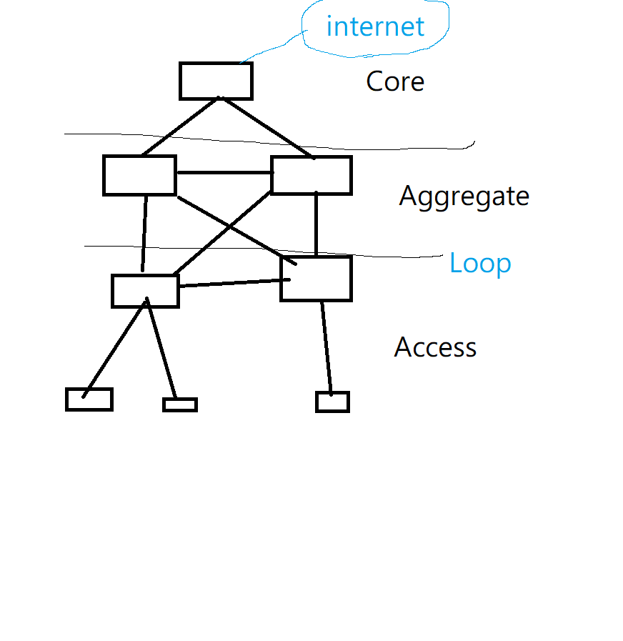
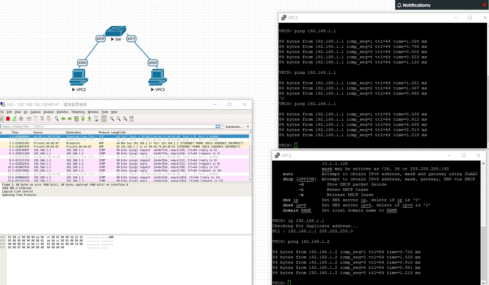
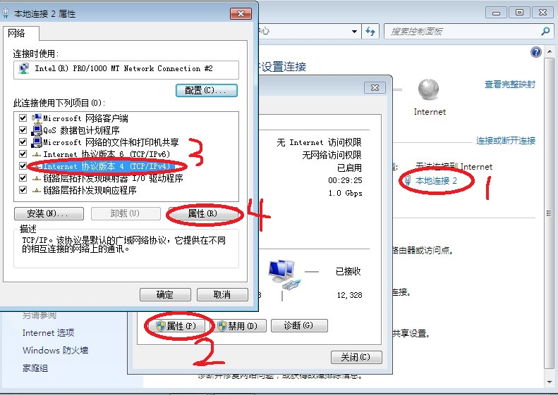
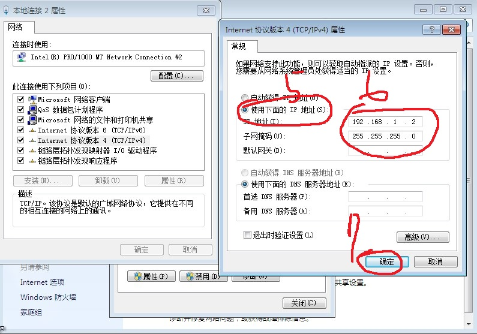

## VLAN
- 把一個區域網路切分為不同的區域網路，實際上是同一台機器上

## 三層結構

- Core
- Aggregate
- Access

# linux 時間設定
 - date -s 20180120

# VMware

# EVE
- 帳密
  - root/eve
  - admin/eve 
- test
  - 簡單測試
  - 
- VMware EVE 關機
  - halt -p
- 安裝虛擬機系統(linux、windows)
  - 將映像檔放入EVE-NG的"/opt/unetlab/addon/qemu"目錄下
  - 在EVE_NG輸入"/opt/unetlab/wrappers/unl_wrapper -a fixpermissions" 指令
  
## kalilinux
- 帳密
  - root
  - toor
- 啟動router 功能
  - echo 1 >> /proc/sys/net/ipv4/ip_forward
- arpspoof 攻擊工具
  - arpspoof -i eth0 -t 192.168.1.2 192.168.1.3
    - 讓192.168.1.2 以為你是192.168.1.3
  - arpspoof -i eth0 -t 192.168.1.3 192.168.1.2
    - 讓192.168.1.3 以為你是192.168.1.2
  - arpspoof 參考資料:
    - https://wizardforcel.gitbooks.io/daxueba-kali-linux-tutorial/content/58.html
## windows
- 網路ip設定
- 開啟網路和共享中心
  - 
  - 

