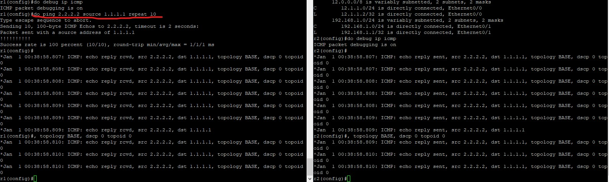

## ping第一個封包失敗
- 因為arp還沒解析完
# router modes
- user mode
  - 進入的預設模式
- 進入privilrdged mode  (#在前面)
  - enable
  - en
- 進入config mode  (config#)
  - config terminal
  - conf t
- 回上層 : exit
# Router 設定指令
## hostname R1 
- 設定名稱
## show runing-config 
- 簡寫:sh run
## write memory
- 簡寫:wr
- 記錄設定
## logging synchronous
- log出現時不會插斷訊息輸入
## ctrl + shift + 6
- 停止錯誤指令
## show ip interface brief
- 將設定列出
## (config)# line consloe 0
- 進入config-line模式
## enable secret (密碼)
- 設定enable密碼
- cisco

# ip設定
## r1(config-if)#
- int e0/0
  - 進入介面
- ip address 12.1.1.1 255.255.255.0
  - 設定ip
- no shutdown
  - no shut
  - 啟動設定

## telnet(vty) 密碼
- Router(config-line)#line vty 0 4 // 0-4 共有五條vty線路,企業版更多
- Router(config-line)#password 密碼
- Router(config-line)#login
- transport input telnet

## show arp 
- 顯示ip arp mapping
## show interface e0/0 
- 顯示interface詳細資訊,如ip addr, mac addr,傳送速度,MTU,送了多少封包,接收多少封包等等

## debug ip icmp
- 開啟debug模式
## no debug all
- 關閉debug模式

## no指令
- 可以取消設定
  - no ip address 12.1.1.1 255.255.255.0
## dhcp設定
- (config)# ip dhcp pool DHCP
- (dhcp-config)# network 192.168.1.0 /24
- (dhcp-config)# default-router 192.168.1.1
- (dhcp-config)# dns-server 8.8.8.8
- @vpc ip dhcp  取得IP
- @vpc show ip 查看

## show ip route
- 顯示路由表

## 設定VPC與Router
- int io 1
  - 進入
- ip addr 2.2.2.2 255.255.255.255
- do show ip int brief
- do show ip route // 檢查路由表
## work
- 用R2 ping 2.2.2.2 指定1.1.1.1回應
- 
# AD值
- AD值越小，優先度越高