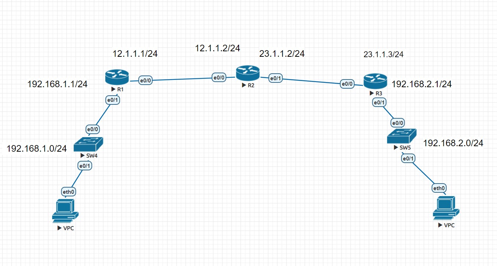

## 2020/10/7

## 網路設定練習
- topo
- 
  - 將兩個VPC連接起來
  - 上方為3個L3路由器
  - 兩個L2 SW在兩側
## 設定步驟
- R1
  - en / conf t 
    - 進入conf模式
  - hostname R1
    - 設定名稱
  - int e0/1
    - 設定 e0/1
  - ip addr 192.168.1.1 255.255.255.0
    - 設定扈ip
  - no shut
    - 啟動設定
  - int e0/0
    - e0/0
  - ip addr 12.1.1.1 255.255.255.0
  - no shut
  - ip dhcp pool DHCP1
  - network 192.168.1.0 /24
  - default-router 192.168.1.1
  - dns-server 8.8.8.8
- VPC1
 - ip dhcp
   - 取得dhcp位址
 - show ip
   - 查看ip位址
 - ping 192.168.1.1
   - ping R1
- R3
  - en
  - conf t
  - hostname R3
  - int e0/1
  - ip addr 192.168.2.1 255.255.255.0
  - no shut
  - int e0/0
  - ip addr 23.1.1.3 255.255.255.0
  - no shut
  - exit
  - ip dhcp pool DHCP2
  - network 192.168.2.0 /24
  - default-router 192.168.2.1
  - dns-server 8.8.8.8
- VPC2
  - ip dhcp
  - show ip
  - ping 192.168.2.1

- R2
  - do show ip route
    - 查看路由
  - do show ip route 192.168.1.0
    - 查看是否與192.168.1.0 連接
  - int e0/0
  - ip route 192.168.1.0 255.255.255.0 e0/0 12.1.1.1
    - 設定與VPC1的路由
  - int e0/1
  - ip route 192.168.2.0 255.255.255.0 e0/1 23.1.1.1
    - 設定與VPC2的路由

