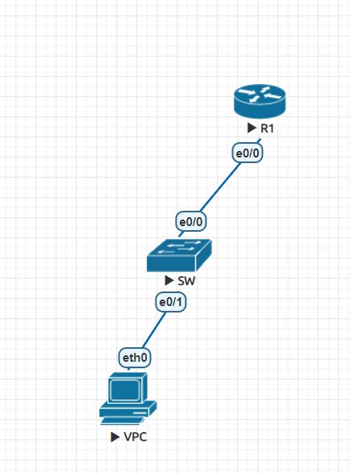
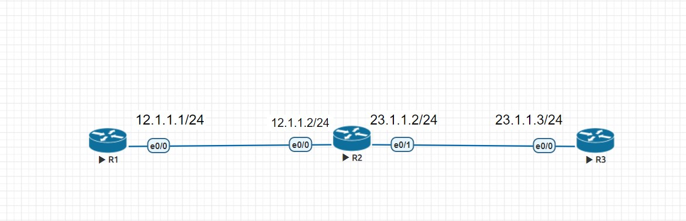

# ipv6 實驗
- topo
  - 
## R1設定
- en
- conf t
  - 進入config模式
- ipv6 unicast-routing
  - 開啟ipv6
- ipv6 route 2001:1::/64 2012::1

- int lo0
- ipv6 addr 2001::2::1/64
- no shut
  - 設定lo0
- int e0/0
- ipv6 addr 2012::2/64
  - 設定 e 0/0
- do show ipv6 int brief
  - 查看ipv6設定
- default int
  - 清除設定
## SW1
- ipv6 unicast-routing

- ipv6 route ::/0 2012::2

- int e0/0
  - no switchport
  - ipv6 enable
  - ipv6 addr 2012::1/64
  - no shut
- vlan 10
- int vlan 10
  - ipv6 enable
  - ipv6 addr 2001:1::FFFF/64
  - no shut
- int e0/1
  - switch mode access
  - sw access vlan 10
- do show ipv6 int brief
  - 查看ipv6設定
## PC
- ip 2001:1::1/64 2001:1::FFFF
- show ipv6
# router rip 小實驗
## router 自動學習路徑
- topo
  - 
