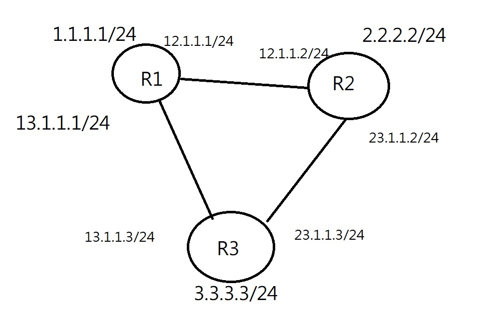

# RIP 協定
- RIP 是放在RFC裡面的
- RIPv1 與 RIPv2

|             |  RIPv1     |    RIPv2   |
|    ----     |  ----      | ----       |
| Layer       | Applicatin | Applicatin |
| VLSM & CIDR |     no     |     yes    |
|      AD     |     120    |     120    |
|   metric    | hop count  |     120    |
|update method| broadcast 255.255.255.255 | multicast 224.0.0.9 |
| Auto Summary | no | yes |

# RIPv2 練習

## work2

