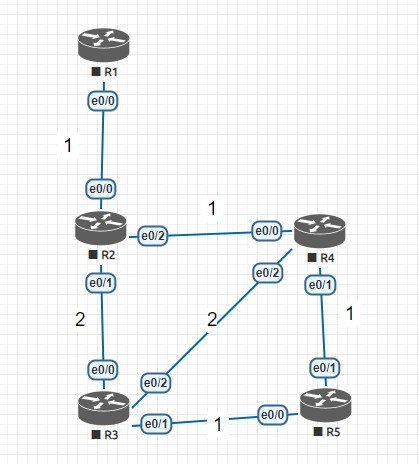
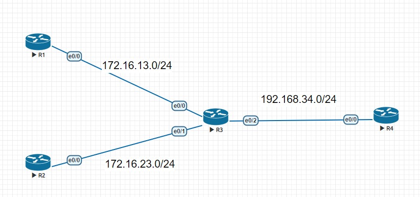
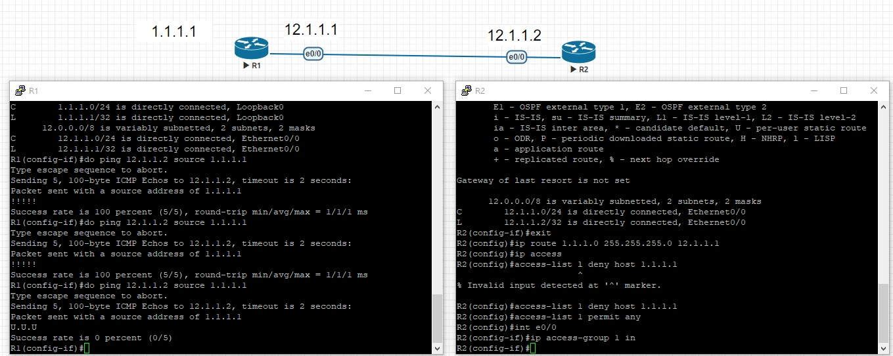
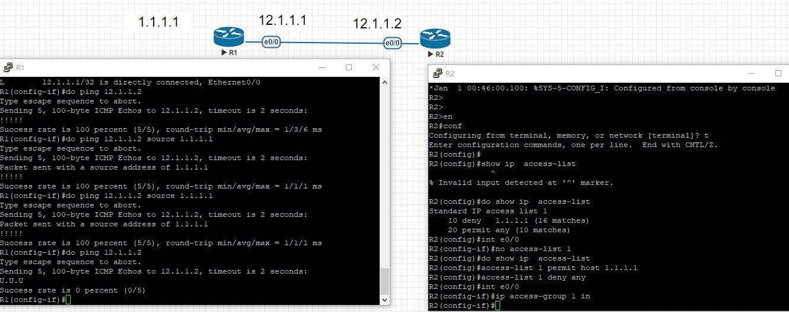

# Eigrp
## eigrp考量的因素比rip多
- BW
  - 頻寬
- delay
- relability
- load
- MTU
- metric
## successor
- 最優路徑的下一跳
# 範例
- 

| R3 | FD | AD |
|----|----|----|
| R4 | 4  | 2  |
| R5 | 4  | 3  |

| R4 | FD | AD |
|----|----|----|
| R2 | 2  | 1  |
| R3 | 5  | 3  |

## Summarization 示範
- 
## access
- 黑名單
- 
- R2
- access-list 1 deny host 1.1.1.1
- access-list 1 permit any
- int e0/0
- ip access-group 1 in

- 白名單
- access-list 1 permit host 1.1.1.1
- access-list 1 deny any
- 