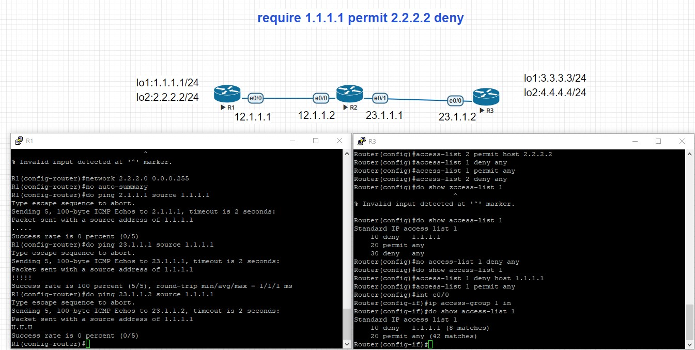

# ACL
## 簡易防火牆
## 資料分類

## ACL:require 1.1.1.1 permit 2.2.2.2 deny
- 標準型規則寫在目的端
- 擴充型規則寫在來源端(省流量)

- 黑名單
- 
- access-list 1 deny host 1.1.1.1
- access-list 1 permit any
- int e0/0
- ip access-group 1 in

- 白名單
- access-list 1 permit host 1.1.1.1
- access-list 1 deny any

- 取消ACL
- no access-list 1

## Extended ACL
- access-list 101 permit ip any any
  - 允許任何主機通過
- access-list 101 deny ip 192.168.3.4 0.0.0.255 192.168.4.5 0.0.0.255
  - 阻擋 192.168.3.4 主機存取 192.168.4.5。
- access-list 101 deny 192.168.2.0 0.0.0.255
  - 阻擋 192.168.2.0/24 主機
- access-list 101 permit tcp host 192.168.3.4 host 192.168.4.5 eq 80
  - 允許192.168.2.4 存取 192.168.4.5 主機的 tcp 埠口 80。
- int fa0/1
- ip access-group 101 out
  - 在 fa0/1 中啟動 OUT 方向的 ACL 10 過濾條件
- 
## 規則設定
- ip access-list extended telnet-acl
- no 30                
  - 刪除編號30的規則
- deny 4.4.4.0 0.0.0.255 eq23
- permit ip any any
- int e0/1
- ip access-group telnet-acl out
- do show access-lists
- 插入規則
  - 5 deny tcp any 3.3.3.0 0.0.0.255 eq23 

## tcp
# 開啟telnet功能
- line vty 0 4
  - 進入line
- password cisco
  - 設定密碼
- login
- transport input telnet
## 連接telnet
- do telnet 4.4.4.4
