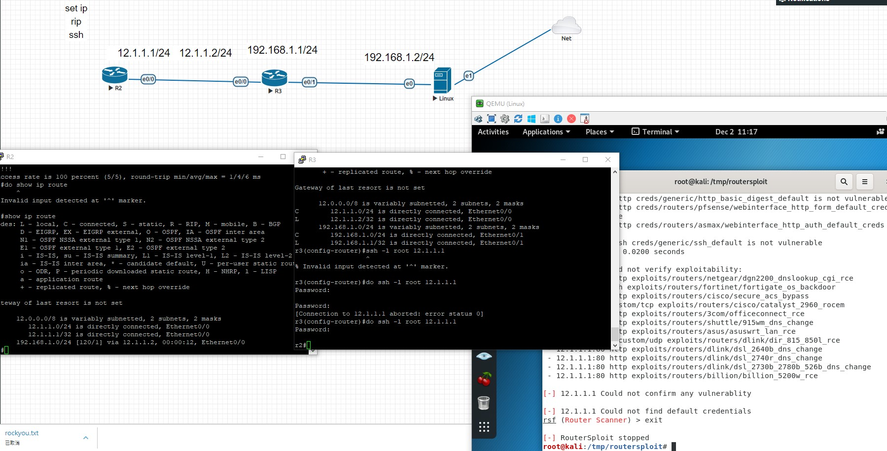

## router rip 複習
- router rip
- version 2
- network 12.1.1.0
- network 192.168.1.0
## 新增NAT 選擇 management
- 
## ssh連線設定router
- ip domain-name test.com
- crypto key generate rsa

- line vty 0 4
- password cisco
- login local
- transport input ssh
## ssh 連線指令
- ssh -l root 12.1.1.1
## linux 時間調整
- apt-get install ntp
- tzselect
- cp /usr/share/zoneinfo/Asia/Taipei /etc/localtime
- 
## linux設定ip
- ip addr add 192.168.1.2/24 brd + dev eth0
- ip route add default via 192.168.1.1
  - 設gateway
## raf.py 掃描密碼 ssh 連線
- 

