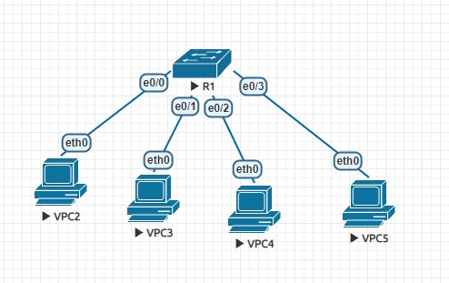
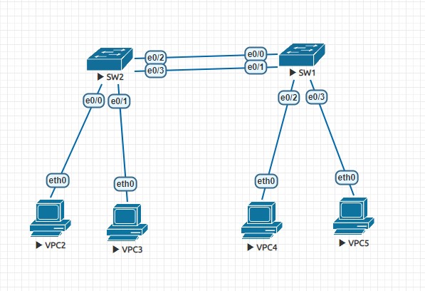
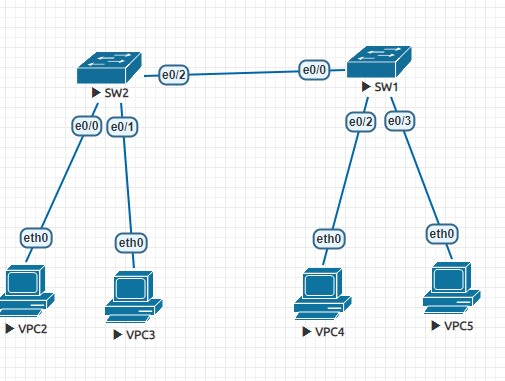
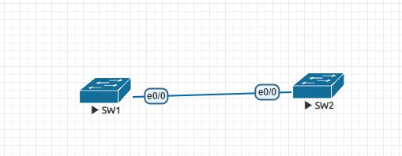

# Vlan簡易設定
# 
## R1為L2交換器
## 設定host ip
- ip 192.168.1.1 255.255.255.0
- ip 192.168.1.2 255.255.255.0
- ip 192.168.1.3 255.255.255.0
- ip 192.168.1.4 255.255.255.0
## 查看vlan表
- do show vlan brief
## 設定vlan
- vlan 10
  - name Valn10
- 檢查是否創建成功
  - do show vlan brief

## 分配vlan
- int e0/0
- switchport mode access
- switchport access vlan 10
# 2個SW
- 
## 在SW2設定好vlan之後,SW2:
- vlan 10
- exit
- vlan 20
- exit
- do show vlan brief
# vlan trunk
- 
## SW2
- int e0/2
- switchport trunk encapsulation dot1q
- switchport mode trunk
- do show int trunk
## 將原生vlan改為10(預設為1)
- int e0/2
- switchport trunk native vlan 10
# 原生vlan不會打標籤(用wireshark抓)

# VTP mode
## Server:能創建,刪除,修改vlan
## Client:不能創建,刪除,修改, 能學習轉發
## transparent:能創建,刪除,修改vlan,不能學習轉發
- 
### SW1:
- vtp domain mynet
- vtp password cisco
- do show vtp status
- do show vtp password
---
- vlan 11-16,1006
- int e0/0
- switchport trunk encapsulation dot1q
- switchport mode trunk
### SW2:
- vtp mode clinet
- vtp domain mynet
- vtp password cisco
- do show vtp status
- do show vlan brief
---
- int e0/0
- switchport trunk encapsulation dot1q
- switchport mode trunk