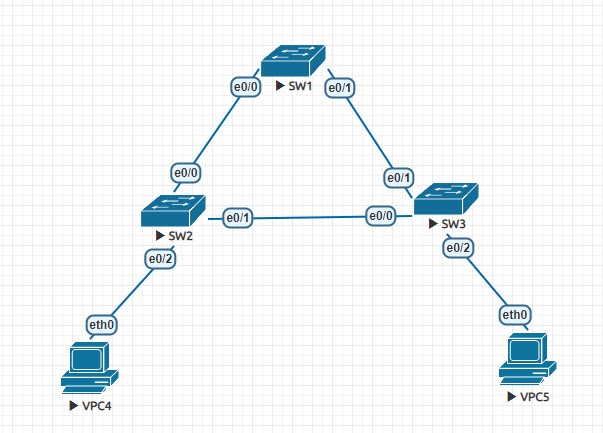
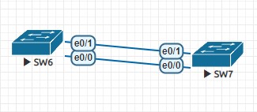
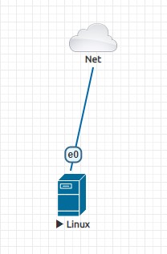
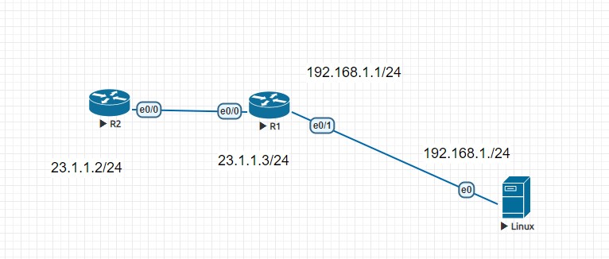

# 交換器小實驗 Ether channel

## 1.查看
## topo
- 

## 兩台SW
## topo
- 
## SW6:
- en
- conf t
- interface range e0/0-1
  - 一次設定e0/0、e0/1
- channel-group 1 mode on
  - Creating a port-channel interface Port-channel 1

## ubuntu tacacs+
## topo
- 
## 先連上網路 安裝環境
### 調整時間
- timedatectl set-timezone "Asia/Taipei"
- systemctl restart ntp
- 資料來源: https://www.twblogs.net/a/5c220b1bbd9eee16b4a769ce
- 如果有出錯 可嘗試 libwrap0 與bison
  - apt-get install libwrap0-dev flex bison

## linux環境安裝完成後
## topo2
- 
## Router設定ip
- en
- conf t
- int e0/1
- ip addr 192.168.1.1 255.255.255.0
- no shut
---
- do ping 192.168.1.2
## linux:設定ip、測試連線
- ifcongig etho 192.168.1.2/24
---
- ping 192.168.1.1